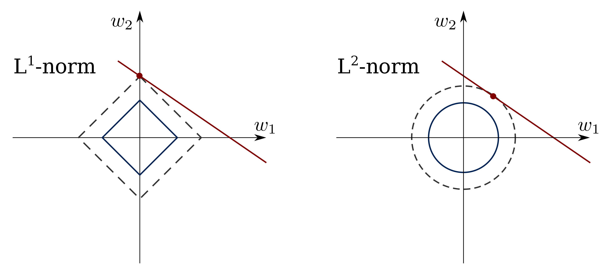

```{r setup, include=FALSE}
# knitr global options for document rendering
knitr::opts_chunk$set(echo = TRUE)
# make tidymodels output print better in dark mode
options(tidymodels.dark = TRUE)
# set global plot theme for ggplot2
ggplot2::theme_set(ggplot2::theme_bw())
```

------------------------------------------------

#### You'll want to install these packages before starting!

```         
install.packages(c('pdp', 'tidymodels', 'tidyverse', 'glmnet', 'naniar', 'broom', 'gtsummary', 'gt', 'glmnet', 'xgboost', 'beepr', 'patchwork', 'ggbeeswarm'))
```

```{r libs, message=F, warning=F}
# load packages
library(tidyverse)
library(tidymodels)
library(broom)
library(glmnet)
library(xgboost)
library(pdp)
library(naniar)
```


---------------------------------------------------

## Pima Indians Diabetes Data

Classic dataset: 762 subjects, labels for diabetes diagnosis (binary), and 8 other physiological variables.

```{r dataset}
# for details run: ?pdp::pima
pima <- tibble(pdp::pima)
glimpse(pima)
```

---------------------------------------------------

### Missing Data

**Missing data** is a common problem! Here we are missing both insulin and triceps in a chunk of the subjects. We need to be aware of any patterns of missing-ness. (Visualization is good approach here)

```{r missing, fig.height=4, fig.width=8}
# naniar does handy plots for missingness
lst(
  naniar::vis_miss(pima, cluster = T) +
    labs(title = 'Subjects clustered by missingness'),
  naniar::gg_miss_var(pima, facet = diabetes) +
    labs(title = 'Missingness by diabetes outcome')
) |> 
  patchwork::wrap_plots(nrow = 1)
```

-----------------------------------------------------

### Class Imbalance

We should also be aware that our data is **imbalanced**, there are \~2x as many negatives as positives for the `diabetes` outcome. Our outcome is a factor with two levels (1st: no diabetes, 2nd: diabetes).

```{r imbalance}
pima |> count(diabetes)
```

----------------------------------------------------

## Some Exploratory Analysis

It's recommended to take a look at each variable to understand it's distribution.

```{r eda, fig.width=8, fig.height=4}
pima |> 
  pivot_longer(-diabetes) |> 
  ggplot(aes(diabetes, value, 
             color = diabetes, 
             fill = diabetes)) +
  geom_violin(na.rm = T, alpha = 0.05) +
  ggbeeswarm::geom_beeswarm(
    size = .01, 
    alpha = .21, 
    na.rm = T
  ) + 
  facet_wrap(~name, scales = 'free') +
  theme(
    axis.title = element_blank(),
    axis.text.x = element_blank(), 
    axis.ticks.x = element_blank()
    )

```

----------------------------------------------------

## GLM for Inference

Let's fit a logistic regression with all the variables, so we can examine the relationship between these and the outcome. We'll just omit the subjects with missing data for now (one option but issues..., *discuss*).

```{r}
# fit logistic regression with glm; '.' is everything; binom for LR
# formula = outcome ~ x1 + x2 ...
mod <- glm(formula = diabetes ~ ., 
           data = na.omit(pima), 
           family = 'binomial')

# summary is easy but a bit annoying to work with...
summary(mod)
```

`broom` is great for working with linear models.

```{r}
# extracting parameter estimates (log-odds ratios)
broom::tidy(mod)

# get odds-ratios, 95% CIs
broom::tidy(mod, exponentiate = T, conf.int = T, conf.level = .95)

# for model goodness of fit
broom::glance(mod)

# for fitted vals, residuals
broom::augment(mod)

# similarly to `tidy`, but for `gt` display table
gtsummary::tbl_regression(mod, exponentiate = T) |> 
  gtsummary::as_gt() |> 
  gt::tab_header(title = 'Pima Indians diabetes log. reg.')

rm(mod)
```


---------------------------------------


## A Predictive Modelling Workflow

First, we **split** the data (randomly) and save some for **testing** after we've tuned our models. Then, we create **resamples** of our training data so we can perform many performance trials for **hyperparameter tuning**. There are many ways to resample, but the most common is repeated 10-fold **cross-validation** (CV). Other methods include leave-one-out CV (LOOCV) and bootstrapping.


```{r}
# synchronize the random number sequence for reproducibility
set.seed(1234)

# split data into training and test subsets.
pima_split <- initial_split(pima, strata = diabetes, prop = 3/4)
pima_train <- training(pima_split)

# create splits for cross-validation
set.seed(4321)
pima_folds <- vfold_cv(
  data = pima_train,
  v = 10, 
  repeats = 1, 
  strata = diabetes
)
```


------------------------

### Preprocessing with `recipes`

Our data needs some **pre-processing** before we fit our models. We would like to fill our missing values by imputation rather than discarding them. 

We might want apply some other transformation before modelling, eg. to center and scale numeric predictors (for some algorithms); mean and sd are learned parameters!

To prevent **data leakage**, we want pre-processing to also be 'trained' only on the training data, not on the validation/test data. Doing the pre-processing before CV is cheating because it uses info from the test data.

`recipes` is a great way to declare what pre-processing steps will occur for each fold during model evaluation. Here we perform normalization, then imputation using 5-nearest neighbours.

```{r}
pima_recipe <- 
  recipe(formula = diabetes ~ .,  data = pima_train) |> 
  step_normalize(all_numeric_predictors()) |> 
  step_impute_knn(all_numeric_predictors(), neighbors = 10) 
```


---------------------------------------

### Hyperparameters and grid search

Now let's pick a couple models and set them up for **hyperparameter tuning** by CV. 

We'll do an elastic net logistic regression (mix of LASSO and Ridge regression) with `glmnet` and we'll compare that against the more powerful `xgboost` algorithm, which uses an ensemble of many decision trees (basically).

Hyperparameters are model parameters that control the learning process, and these cannot be learned from the data (we have to do it empirically).

```{r}
# glmnet does logistic regression with regularization 
# regularization shrinks the model coefficients
# modulate regularization with hyperparameters
# penalty (strength) and mixture (type L1 or L2)
glmnet_spec <- logistic_reg(
  mode = 'classification', 
  engine = 'glmnet', 
  penalty = tune(), 
  mixture = tune()
)

# create a grid of HP settings to evaluate
glmnet_grid <- grid_regular(
  penalty(), 
  mixture(),  
  levels = 12
)
```


{style="background-color: #efefef;"}

There's a table `parsnip::model_db` with all the models you can use.
If you want to find out what hyperparameters are available for each model, query this table and `unnest` the parameters column.

```{r}
# what xgboost hyperparameters can be tuned??
parsnip::model_db |> 
  filter(mode == 'classification', engine == 'ranger') |> 
  unnest(parameters) |>
  select(parameter)
```


We'll specify a **Random Forest** classifier (multi-tree ensemble) and mark the number of predictors to sample (mtry) and minimum n for node splitting (min_n) for tuning. These HPs define how the decision trees in the ensemble are created.

```{r}
# xgboost is complicated... an ensemble of decision trees
ranger_spec <- rand_forest(
  mode = 'classification', 
  engine = 'ranger', 
  mtry = tune(), 
  min_n = tune(),
)

# a grid of hyperparameter tunings for xgb; there are many different hp.s
ranger_grid <- grid_regular(
  mtry(range = c(4,8)), 
  min_n(), 
  tree_depth(), 
  levels = 10
)
```

We can then combine our preprocessing steps and model specification into a `workflow` object that is easy to apply to our CV splits.

```{r}
glm_wf <- 
  workflow() |> 
  add_model(glmnet_spec) |> 
  add_recipe(pima_recipe)

ranger_wf <- 
  workflow() |>
  add_model(ranger_spec) |> 
  add_recipe(pima_recipe)

```


Time to select how we want to evaluate our model performance...
`yardstick` has tons of different metrics for evaluating classification and regression models. We'll use some common ones, and my fav Matthew's Correlation Coefficient (mcc).

```{r message=F, warning=F}
# these metrics all come from yardstick:: 
cv_mets <- metric_set(mcc, roc_auc, accuracy, sens, spec)
```

## Do CV

`tune_grid` performs two loops - one loop over all the folds for CV, and one over all the hyperparameter settings that need to be evaluated within each fold. We pass it our cv object with the splits, the grid of hyperparameter settings, and the metrics we want to compute.

```{r message=F, warning=F}
# perform fit a model for each comb. of hyperparameters 
rs_glmnet <- tune::tune_grid(
  wf_glmnet,
  resamples = pima_folds, 
  grid = grid_glmnet,
  metrics = cv_mets,
  control = tune::control_grid(parallel_over = 'resamples')
)

# CV takes a long time, so get a beep when done
beepr::beep()
```


```{r}
# check out the results...
rs_glmnet |> collect_metrics(summarize = T)

# select 'the best' model based on some metric
rs_glmnet |> select_best(metric = 'mcc')
rs_glmnet |> select_best(metric = 'roc_auc')

# generally want to choose the simplest model
# that doesn't perform significantly worse than
# the best one! 
best_glmnet <- rs_glmnet |> 
  select_by_one_std_err(
    desc(penalty),
    metric = 'mcc'
  )
```

`autoplot` will visualize performance across different settings. 

```{r}
autoplot(rs_glmnet)
```

Let's do the CV with our xgb model now.

```{r}
# do cv for xgboost 
rs_xgb <- tune_grid(
  wf_xgb,
  resamples = pima_folds, 
  grid = grid_xgboost,
  metrics = cv_mets,
  control = tune::control_grid(parallel_over = 'resamples')
)

beepr::beep()
```

and inspect MCC across settings,

```{r}
autoplot(rs_xgb, metric = 'mcc')
```

```{r}
# pick 'best' model that minimizes (tree_depth) 
best_xgb <- select_by_one_std_err(
  rs_xgb, 
  tree_depth, mtry, min_n, 
  metric = 'mcc'
)
```
## Compare MCC performance from CV resampling for two models

```{r}
bind_rows(
  best_glmnet, 
  best_xgb
  )
```

---------

## Testing

Time to fight the final boss, i.e. to fit our selected the models on the full training set, then predict the outcomes for the test set (which was set aside at our initial split).

`finalize_workflow` extracts our favourite model + hyperparameters, then `last_fit` fits the model on the training part of the initial split and predicts the testing portion. We use `collect_metrics` to get the metrics that were computed from the predictions vs. actual values.

```{r}
# select final workflow, fit on train, and predict test 
final_glmnet <- 
  wf_glmnet |> 
  finalize_workflow(parameters = best_glmnet) |> 
  last_fit(split = pima_split,
           metrics = cv_mets) 

# collect final metrics from test set predictions
test_glmnet <- 
  final_glmnet |> 
  collect_metrics() |> 
  mutate(algo = 'glmnet', .before = 1)
print(test_glmnet)
```


```{r}
# finalize xgb
final_xgboost <- 
  wf_xgb |> 
  finalize_workflow(parameters = best_xgb) |> 
  last_fit(split = pima_split,
           metrics = cv_mets)

# collect xgb results
test_xgboost <- 
  final_xgboost |> 
  collect_metrics() |> 
  mutate(algo = 'xgboost', before = 1)
```


```{r}
# compare test performance between models
bind_rows(test_glmnet, test_xgboost) |> 
  select(-.estimator, -.config) |> 
  pivot_wider(names_from = .metric, values_from = .estimate)
```


----------

## Challenge

Find a dataset that interests you on https://kaggle.com, do some exploratory analysis and prepare your data for predictive modelling. Perform hyperparameter tuning and model evaluation by resampling (use nested CV if bored). See how your models stack up against the competition. Combine multiple models into an ensemble with `stacks`, evaluate many models with `workflowsets`... go nuts!

----------

<details>

<summary>Rmarkdown!?: Click to expand</summary>

This is an **Rmarkdown** .Rmd file (or report if looking at html output). I'm writing text here that will appear as prose in the report. Code blocks are wrapped with \`\`\` to tell R to execute those bits. The output will go directly into the report (so cool)! To run all the code contained in this file (as if it were a normal R script) and create the report (.html format in this case), simply *knit* the .Rmd file (with the R package `knitr` which is already tightly integrated into Rstudio - there is a button to 'knit').


```{r}
sessionInfo()
```


</details>

<br/>


------

